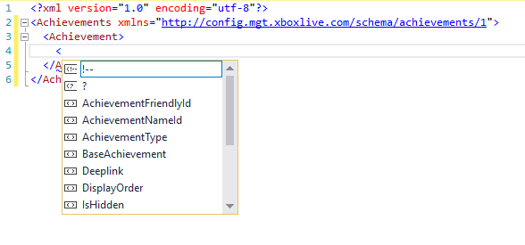

## Config as Source

### Introduction
When configuring Xbox Live for your title in Dev Center, there are several things that are configured, from leaderboards to achievements, to web services and 
relying parties. For many game developers, using Dev Center is sufficient. For advanced users, however, there is a desire to integrate common tasks into their 
own processes and tools. In the past, publishers have used various non-orthodox methods to accomplish this, such as screen scraping or website scripting. This 
proved to be difficult and error-prone, with high volatility and likelihood of breakage.

Config as Source is a suite of tools that Microsoft developed to accommodate advanced users, by providing officially supported tools and APIs for integrating 
into our configuration services. Currently, we are providing this functionality as an open source C# class library available as both source code as well as a 
NuGet package and including fully functional executables which are shipped as part of the Xbox Live SDK.

In the future, Microsoft will be providing additional avenues for integration into partner software in the form of PowerShell commandlets, Visual Studio 
extensions, Unity extensions, and more.

### How configuration works
Xbox Live configuration for a game is accomplished in different ways depending on the service. Much of the configuration is in the form of documents. Other 
portions are managed through traditional CRUD type services, like Web Services.  Finally, there are services, like Relying Parties, that use a combination 
of both documents and CRUD services.

### Documents
Documents are typically one or more XML documents for a given feature. For example, the achievements.xml document describes the achievement configuration for 
your game.

In some cases, there are different major versions of the same feature. In the case of achievements, there are two different versions, each described by different 
documents. Achievements 2013 is configured in the achievements.xml document, whereas Achievements 2017 is configured in the achievements2017.xml document. In most 
cases, these documents are mutually exclusive, meaning only one can be used at a time.

These documents are what are called “Developer Documents”; they are the documents that you, the developer, are responsible for authoring. As a developer, you can 
modify and commit these documents as much as you want without consideration for whether they are deemed “valid” or not.

Once the documents are ready, you can then “publish” them. This transforms the documents into a form that is understandable to the Xbox Live services which depend 
on them and instructs these services to use them for configuration information. The format in which they are transformed into is inconsequential, varies from 
service to service, and should be considered opaque to the game developer.

### Sandboxes
Sandboxes allow for your service configuration to live inside of content isolation, enabling you to test the Xbox Live features of your game without the risk of 
exposing content to the outside world. Sandboxes that you as a developer will interact with most are what are called “developer sandboxes”. These sandboxes can be
identified by a combination of a moniker and a number. For example: ABCD.1.

Some sandboxes are referred to “built-in” sandboxes. These include ALL, CERT, and RETAIL. Once configuration is placed inside of the RETAIL sandbox, it is 
considered live. There is a large amount of failsafe’s in place to ensure that bad configuration data does not go to the RETAIL sandbox.

Most configuration documents will go into developer sandboxes and will be promoted to CERT and RETAIL through the normal publishing pipeline. Other configuration
documents only live in the ALL sandbox, while some documents called account level documents don’t live in sandboxes at all.

## Metadata
The Config as Source tools can be used to obtain metadata about your products and sandboxes.

### Product List
You can obtain information about the products you own by making the following call:
```
XblConfig.exe get-products [--accountId xxx]
```

In all cases where account ID is called for, if you just want to default to your own account ID, that parameter can be omitted. The parameter is included for 
use by account managers who maintain multiple accounts and need to “Work On Behalf Of” or WOBO an account other than their own.

This call returns a list of products you have access to:

```
C:\Tools\XboxLive>XblConfig.exe get-products
Using Dev account bob@contoso.com from WindowsDevCenter
Obtaining products.
Product ID                            Package Family Name                   Title ID    Tier
00000000-0000-0000-0000-00000007bc9a  Contoso.FunTime_q0hwd5gyxxh55         1123314074  Full
00000000-0000-0000-0000-000000061ca1  Contoso.BoulderDash_q0hwd5gyxxh55     1123304737  Full
00000000-0000-0000-0000-000000050760  Contoso.FastRacers_q0hwd5gyxxh55      1123108128  Open
```

### Product Data
Once you have a product ID, you can query for a product to obtain full details about it by making the following call:
```
XblConfig.exe get-product --productId xxx
```

For example:

```
C:\Tools\XboxLive>XblConfig.exe get-product --productId 00000000-0000-0000-0000-00000007bc9a
Using Dev account bob@contoso.com from WindowsDevCenter
Obtaining product.
ProductId:              00000000-0000-0000-0000-00000007bc9a
AccountId:              816d422d-472f-48f7-a773-000003ca7c2
MsaAppId:               0000000000003457
PfnId:                  Contoso.FunTime_q0hwd5gyxxh55
PrimaryServiceConfigId: 00000000-0000-0000-0000-00006047bc9a
TitleId:                1123314074
XboxLiveTier:           Full
AlternateIds:
  AppId:                9N8F1FUJGS6
```

### Sandboxes
It is possible to get a list of sandboxes associated with your account. Please note that, depending on your privilege settings, you may 
have access to some additional sandboxes.

You can get a list of sandboxes by using the following call:
```
XblConfig.exe get-sandboxes [--accountId xxx]
```

If accountId is omitted, the account ID of the currently logged in user will be used. For example:

```
C:\Tools\XboxLive>XblConfig.exe get-sandboxes
Using Dev account bob@contoso.com from WindowsDevCenter
Getting list of sandboxes.
ACBXTT.0
ACBXTT.1
ACBXTT.58
ACBXTT.77
```

### Schemas
Each of the developer documents have XSD schemas associated with them. These schemas can be used for automatic generation of strongly 
typed classes and/or Intellisense support inside of Visual Studio.

#### Types
To obtain a list of all supported document schema types, use the following call:
```
XblConfig.exe get-schemas [--type xxx] [--version xxx] [--destination path]
```

If you omit all the optional arguments, then you will receive a list of all possible document types. For example:
```
C:\Tools\XboxLive>XblConfig.exe get-schemas
Using Dev account bob@contoso.com from WindowsDevCenter
Obtaining document schema types.
 - accesspolicies
 - achievements
 - achievements2017
 - businesspartner
 - custominvitestrings
[snipped]
```

#### Versions

Each document type has one or more versions associated with it. To obtain a list of versions, make the same call but specify the document type. For example:

```
C:\Tools\XboxLive>XblConfig.exe get-schemas --type userstats
Using Dev account bob@contoso.com from WindowsDevCenter
Obtaining document schema versions for type userstats.
1 - http://config.mgt.xboxlive.com/schema/userstats/1
2 - http://config.mgt.xboxlive.com/schema/userstats/2
```

#### Schema Download

Once you have the document type and version, you can download the XSD schema by specifying the destination. If destination is omitted, the schema is output to the console.

For example:

```
C:\Tools\XboxLive>XblConfig.exe get-schemas --type userstats --version 2 --destination c:\
Using Dev account bob@contoso.com from WindowsDevCenter
Obtaining document schema userstats for version 2.
Schema saved as c:\userstats_2.xsd
```

#### Class Generation

Once the XSD schema is downloaded and saved, it can be used by the XSD tool that ships with Visual Studio to generate strongly typed classes. For example: 
```
C:\Tools\XboxLive\xsd>xsd userstats_2.xsd /classes
Microsoft (R) Xml Schemas/DataTypes support utility
[Microsoft (R) .NET Framework, Version 4.6.1055.0]
Copyright (C) Microsoft Corporation. All rights reserved.
Writing file 'C:\Tools\XboxLive\xsd\userstats_2.cs'.
```

For more information about the XML Schema Definition Tool, please reference the [XSD tool documentation](https://aka.ms/xsdtool).

#### Intellisense

Once the schemas have been saved to your computer, you can take advantage of the Intellisense features of Visual Studio when modifying your XML documents.

To do this, create a new XML file in Visual Studio. In the Properties window, select the location of the schema you wish to use on the Schemas property. 
Once you’ve done this, manipulating Xbox Live configuration documents will have full support of Intellisense.



## Documents
The primary way to configure an Xbox Live title is through the manipulation of developer documents.

### Obtaining Documents
There are two main types of documents to obtain and manipulate. There are Sandbox documents which deal with configuring a specific title, and Account 
documents which are shared across all titles for a given account. When obtaining documents, they are downloaded from the network in a compressed archive. 
The library automatically decompresses the archive for you.


#### Sandbox Documents
Sandbox documents are obtained with the following call:
```
XblConfig.exe get-documents --scid xxx --sandbox xxx --destination xxx [--type Sandbox] [--view Working|Published] [--configset xxx]
```

The type argument can be either Sandbox or omitted. The view argument can be either Working or Published and defaults to Working. The configset argument 
specifies the version to download and will default to the version if omitted. For example:
```
C:\Tools\XboxLive>XblConfig.exe get-documents --scid 00000000-0000-0000-0000-00000007bc9a --sandbox ALL --destination c:\temp
Using Dev account bob@contoso.com from WindowsDevCenter
Obtaining sandbox documents.
ETag: "75983f5a-032b-4d3b-9762-bbeb0bc2b6f3"
Version: 26799369
Files:
 - dataplatformconfig.xml
 - nsal.xml
 - productdeveloper.xml
 - productsystem.xml
 - titlepriv.xml
 - xrexceptions.xml
Saved 6 files to c:\temp.
```

#### Account Documents
Account documents are obtained with the following call:
```
XblConfig.exe get-documents --type Account --destination xxx [--view Working] [--accountId xxx]
```

The type argument must be Account. The view argument can be either Working or Published and defaults to Working if omitted. If the accountId is 
omitted, the accountId of the currently logged in user is used. For example:
```
C:\Tools\XboxLive>XblConfig get-documents --type Account --view Working --destination c:\temp
Using Dev account bob@contoso.com from WindowsDevCenter
Obtaining account documents.
ETag: "4b2999e0-a1a8-4529-a139-7c636ae9961f"
Version: 2807096
Files:
 - businesspartner.xml
 - relyingparty-1d3b0a8e-275b-4ead-851e-14a19e5f39ce.xml
 - relyingparty-5e71dc6b-5078-4834-91a4-a4b96a147495.xml
 - relyingparty-b013a3dd-0ef2-4c26-b66f-256335f87dd1.xml
 - relyingparty-f8a28056-940d-4ce9-b554-3257777d3456.xml
Saved 5 files to c:\temp.
```

#### ETags
When documents are downloaded, you will notice that an ETag is part of the response. This ETag is used for optimistic concurrency 
which means that when committing documents back to Xbox Live, you will need to also supply this ETag. It should be considered an 
opaque string.

To make this process a little easier, a hidden file containing the ETag is created when documents are downloaded. When committing 
documents, if the ETag argument is omitted, the value of this file is used.

### Committing Documents
Before committing documents back to Xbox Live, you can perform a validation pass by simply including the ```--validateOnly``` flag. This won’t commit the 
documents, but will validate the attempt and return a response indicating success or failure.

The ```--files``` parameter takes a list of files to commit (space separated) and will support wildcards (such as *.xml).

If you pass the ```--eTag``` argument, it will use that value for optimistic concurrency. If you omit it, the program will 
attempt to use the eTag saved in the hidden file in that directory. To ignore the eTag altogether, use the ```--force``` flag which will obtain 
the latest eTag automatically and bypass optimistic concurrency checks.

The ```--message``` parameter is used for a commit comment and is optional.

#### Sandbox Documents
Sandbox documents are committed with the following call:
```
XblConfig.exe commit --scid xxx --sandbox xxx --files xxx [--type Sandbox] [--validateOnly] [--eTag xxx] [--force] [--message xxx]
```

The commit response will include a list of warnings and errors associated with the commit. Warnings are generally ok, and mean that the documents 
can be committed, but that you may have problems publishing to CERT or RETAIL in the future. Errors mean the document must be fixed before the 
commit will be allowed. For example:
```
C:\Tools\XboxLive>XblConfig.exe commit --scid 00000000-0000-0000-0000-00000007bc9a --sandbox ALL --files c:\temp\*.xml
Using Dev account bob@contoso.com from WindowsDevCenter
Committing 6 file(s) to Xbox Live.
Committing sandbox documents.
Can Commit: True
Committed:  True
Warnings:
 - There must be at least one rich presence string configured
 - The number of Base achievements for this game must be 10 or more. There are currently 2.
 - The Base achievements for this game must total exactly 1000 Gamerscore. You currently have 150.
```

#### Account Documents
Account documents are committed with the following call:
```
XblConfig.exe commit --type Account --files xxx [--accountId xxx] [--validateOnly] [--eTag xxx] [--force] [--message xxx]
```

For example:
```
C:\Tools\XboxLive>XblConfig.exe commit --type Account --files c:\temp\*.xml
Using Dev account bob@contoso.com from WindowsDevCenter
Committing 1 file(s) to Xbox Live.
Committing account documents.
Can Commit: True
Committed:  True
```

## Achievement Images
Images associated with achievements and challenges can be managed with this tool. The location of the achievement image isn’t referenced in the 
achievement document, instead, an identifier is referenced. This tool allows for the upload of an image which, in turn, obtains this identifier
and allows it to be resolved back to the image details.

### Upload achievement image
Achievement images can be uploaded and associated with titles. This tool ensures that the image is valid, in the correct format, with the correct 
dimensions, and uploads and associates it with a title. 

Achievement images are uploaded with the following call:
```
XblConfig.exe upload-achievement-image --scid xxx --file xxx
```

Once uploaded, the location of the uploaded image is returned so that you can verify it is available. For example:
```
C:\Tools\XboxLive>XblConfig.exe upload-achievement-image --scid 00000000-0000-0000-0000-00000007bc9a --file C:\temp\ach.jpg
Using Dev account bob@contoso.com from WindowsDevCenter
Uploading achievement image.
Image uploaded to: http://assets1.xboxlive.com/11/1f4b45ab-f02c-4fd5-8d4d-d363fb898e08/ach.jpg
```

### Achievement image details
To translate an achievement image’s asset ID to a URL, use the following call:
```
XblConfig.exe get-achievement-image --scid xxx --assetId xxx
```

For example:
```
C:\Tools\XboxLive>XblConfig.exe get-achievement-image --assetId 5709dbfa-e08e-4556-a02e-df42cbdea49f --scid 00000000-0000-0000-0000-00000007bc9a
Using Dev account bob@contoso.com from WindowsDevCenter
Getting achievement image.
http://assets1.xboxlive.com/11/1f4b45ab-f02c-4fd5-8d4d-d363fb898e08/ach.jpg
```


## Web Service Management
If your title will use a web service to make calls to an Xbox Live service, either directly or on behalf of individual users, you will need a 
business partner certificate. You will need to register your Web Service with Xbox Live and generate a certificate for use with the services.

### Get web services
You can obtain a list of web services associated with your account by using the following call:
```
XblConfig.exe get-web-services [--accountId xxx]
```

For example:
```
C:\Tools\XboxLive>XblConfig.exe get-web-services
Using Dev account bob@contoso.com from WindowsDevCenter
Obtaining web services.
Name                  Service ID                            Telemetry Access
TestWebservice        816d422d-472f-48f7-a773-6dce323ca7c2  True
```

### Create web service
You will need to register each web service that communicates with Xbox Live.  The call to do this is:
```
XblConfig.exe create-web-service --name xxx [--accountId xxx] [--telemetryAccess] [--appChannelAccess]
```

If the accountId is omitted, the accountId associated with the currently logged in account will be used. Telemetry access enables your service 
to retrieve game telemetry data for any of your games. AppChannelAccess gives the media provider owning the service the authority to 
programmatically publish app channels for consumption on console through the OneGuide twist. For example:
```
C:\Tools\XboxLive>XblConfig.exe create-web-service --name MyWebService --telemetryAccess --appChannelAccess
Using Dev account bob@contoso.com from WindowsDevCenter
Creating web service.
Web service created with ID adc1b1bc-148e-4a86-9740-579a8fe4527f
```

### Update web service
Once a web service is created, its properties can be modified with the following call:
```
XblConfig.exe update-web-service --serviceId xxx --name xxx [--accountId xxx] [--telemetryAccess] [--appChannelAccess]
```

For example:
```
C:\Tools\XboxLive>XblConfig.exe update-web-service --serviceId adc1b1bc-148e-4a86-9740-579a8fe4527f --name MyWebService2
Using Dev account bob@contoso.com from WindowsDevCenter
Updating web service.
Web service with ID adc1b1bc-148e-4a86-9740-579a8fe4527f successfully updated.
```

### Delete web service

Web services can be deleted with the following call:
```
XblConfig.exe delete-web-service --serviceId xxx [--accountId xxx]
```

For example:
```
C:\Tools\XboxLive>XblConfig.exe delete-web-service --serviceId adc1b1bc-148e-4a86-9740-579a8fe4527f
Using Dev account bob@contoso.com from WindowsDevCenter
Deleting web service.
Web service with ID adc1b1bc-148e-4a86-9740-579a8fe4527f successefully deleted.
```

### Generate web service certificate

Once a web service has been registered with Xbox Live, you will need to generate a certificate to install on your web service. Typically, 
this is done by generating a CSR or Certificate Signing Request and sending that to Xbox Live. Through that process, a certificate is generated, 
and a certificate public key is sent back to you. You then will have to install that certificate on the same computer in which the CSR was generated 
so that the private key can be properly paired with it. Then, you will need to export the Personal Information Exchange file or .pfx file which will 
need to be password protected. This file can then be installed on one or more web servers you control.

This process is now completely automated with the following call:
```
XblConfig.exe --serviceId xxx --destination xxx [--accountId xxx]
```

This will prompt you for a password, which is securely stored in memory and is not transmitted over the network. It will generate the CSR, transmit 
it to Xbox Live which generates the certificate and sends it back in .cer format, it will then pair it with your private key and secure it with your 
password and save it as a .pfx file. 

> NOTE: The tool must be run as an administrator as that is required for generating certificate signing requests.

For example:
```
C:\Tools\XboxLive>XblConfig.exe generate-web-service-cert --serviceId adc1b1bc-148e-4a86-9740-579a8fe4527f --destination c:\temp\cert.pfx
Using Dev account bob@contoso.com from WindowsDevCenter
Generating web service certificate.
Please enter the password you would like to secure this certificate with: ********
Certificate generated.
```


## Publishing
Once configuration documents have been committed to Xbox Live, you can publish them, making them available to the Xbox Live runtime services utilized by your game. 

### Publish
This action is used either for publishing configuration information from the same sandbox as its destination, or for from one sandbox to another.

These actions apply to development sandboxes only. Publishing to CERT or RETAIL must be done through dev center since it’s tied to non-Xbox Live aspects of your game.
```
XblConfig.exe publish --scid xxx --from xxx --to xxx [--validateOnly] [--configset xxx]
```

The from and to parameters indicate the names of the sandboxes you wish to publish from and to. Passing the ```--validateOnly``` flag tells the service to
only attempt to publish to see if it will succeed, but not to actually perform the publish. If you pass a ```--configset``` parameter, that version 
will be used, otherwise the latest will be used. 

A validation response will be returned with warnings and errors. For example:
```
C:\Tools\XboxLive>XblConfig.exe publish --scid 00000000-0000-0000-0000-00000007bc9a --from ABCDEF.0 --to ABCDEF.0
Using Dev account bob@contoso.com from WindowsDevCenter
Publishing.
Warnings:
 - There must be at least one rich presence string configured
 - The number of Base achievements for this game must be 10 or more. There are currently 2.
 - The Base achievements for this game must total exactly 1000 Gamerscore. You currently have 150.

Status: Running
Status Message: Product publish started
```

The publishing process is an asynchronous one and can take several minutes to complete.

### Get publish status
You can query the status of the publish job by querying the following:
```
XblConfig.exe get-publish-status --scid xxx --sandbox xxx
```

The sandbox argument is the sandbox you are publishing to. For example:
```
C:\Tools\XboxLive>XblConfig.exe get-publish-status --scid 00000000-0000-0000-0000-00000007bc9a --sandbox ABCDEF.0 
Using Dev account bob@contoso.com from WindowsDevCenter
Getting publish status.
Status: Success
```